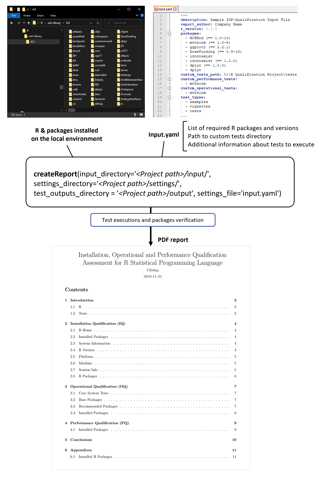

<!-- README.md is generated from README.Rmd. Please edit that file
To render the md file: rmarkdown::render('README.Rmd')
(The package rmarkdown must be installed: install.packages("rmarkdown") ).
-->

# iopqualr

Open-source R program for creating R IQ/OQ/PQ automated reports (the
“Program”).

This package relates to systems and software certification for regulated
environments.

<!-- badges: start -->
<!-- badges: end -->

## Introduction

When **using R in a regulated and controlled environment** (like in the
pharmaceutical research industry), you must ensure and prove that the
output of your R programs are **accurate** and **reproducible**.

The purpose of this package is to **generate automatic** installation,
operational and performance qualification (IQ/OQ/PQ) **assessment report
in PDF** or HTML format for an R installation. Such IQ/OQ/PQ report can
be used to comply with validation and quality assurance requirements
when using R in a regulated environment.

The Program uses as **input** a **YAML** file defining a list of
packages versions and tests to execute, and verifies that these packages
are installed with the expected version and that test run successfully.

As a result, this R package produces a **PDF or HTML report**
summarizing all the IQ/OQ/PQ tests executed and presents a qualification
outcome (PASSED or FAILED). The report also details the operating
environment and installation parameters of the R installation.

This R package can be used on any R environment to ensure that it
matches the expected configuration and works as expected. It is
particularly **useful** in companies having R installed on **several
user environments** and aiming to ensure that they are all **identical
and produce the same results**.

For more information about validation and qualification of R in
regulated environments, we recommend following the [R Validation
Hub](https://www.pharmar.org/overview/).

If you need support to perform your own validation or qualification of
R, feel free to [contact us](https://www.clinbay.com/contact-us) at
ClinBAY, we’ll be happy to support you.

## How it works

As you can see on the below diagram, the process is simple:

1.  **Writing** some automated **tests** to be executed for each
    package, in order to ensure that they work as expected and produce
    correct and reproducible results

2.  **Creating** an **input YAML file** listing the list of required
    packages and their version, along with the path of the directory
    that contains the tests to execute

3.  **Executing** the **function createReport** to produce the output
    PDF report, which lists all the tests executed and presents the
    Qualification outcome

<figure>

<figcaption aria-hidden="true">Diagram</figcaption>
</figure>

## Accessing the package

### Installing the R package

#### Installation from CRAN

You can install the released version of iopqualr from
[CRAN](https://CRAN.R-project.org) with:

``` r
install.packages("iopqualr", dependencies = T)
```

#### Installation from GitHub

To install the package from a GitHub repository:

``` r
#install devtools package
install.packages("devtools")
# In the below, github_url is the path to the github repository
# containing the code.
devtools::install(repo="<github_url>", dependencies = T)
```

#### Installation from a local folder or .zip file

This package can also be installed from a local compressed folder.
Rtools should be installed first from
[Rtools](https://cran.r-project.org/bin/windows/Rtools/) and added to
Environment Variables(installation instructions can be found on the
Rtools page link). Rtools is used on Windows to build R base and R
packages that contain compiled code, and is required to install an R
package from source.

Install the package and other required packages by running:

``` r
#installing .zip file
install.packages("devtools")
devtools::install("C:/path_to_zip/name_of_zip.zip", dependencies = T)
```

Alternatively, if the folder is not compressed, the following can be
used to install the package:

``` r
#install devtools package
install.packages("devtools")
devtools::install("C:/path_to_folder/", dependencies = T)
```

### Loading the package in R

To use the package, it has to be loaded into the R environment.

    library(iopqualr)

### System Requirements

To render the PDF file from an RMarkdown template, both LaTeX and Pandoc
are required

- The LaTeX requirement can be met by installing tinytex
  [LaTeX](https://yihui.org/tinytex/) .
- If RStudio is used then Pandoc is included, otherwise
  [Pandoc](https://pandoc.org/) may have to be installed on your system.

## Usage

### Standard Operating Process

1.  The Program is installed
2.  The user creates a specification file in a structured input format
    such as JSON or YAML (the “Spec”)
    - Spec includes requirements on operating system, R installation, R
      packages (along with their acceptable version number or range).
    - Spec details every R package which must be present and which tests
      to run on each package.
3.  User runs the Program
    - Spec file location (path with a file name) as a parameter
    - Desired Output file location (path with a file name) as a
      parameter
4.  Program runs using Spec as input
5.  Program creates PDF R IQ-OQ-PQ report (the “Output”) and writes to
    output location.

### Inputs

The inputs to the qualification assessments is a YAML specification file
which is read by the package into a an R list. The YAML file can be
generated using the built-in assistant:

``` r
inputHelper()
```

The input file contains the following mandatory elements:

1.  **report_author**: author as should appear on front of the report
2.  **packages**: list of required packages and package versions of the
    same format as the R package DESCRIPTION file
3.  **custom_tests_path**: path to custom test files
4.  **custom_operational_tests**: list of packages for which custom
    operational tests area available and should be run
5.  **custom_performance_tests**: list of packages for which custom
    performance tests area available and should be run

View a sample YAML containing tests specifications:
[sample_input.yaml](pkg/inst/extdata/sample_input.yaml)

### Tests

If any packages are listed in the inputs for custom performance or
operational tests then the `custom_tests_path` directory must contain
tests to run for that package using the `testthat` framework in the
location `custom_tests_path\pkg_name\{operational, performance}`.

### Pre-Requisites to Running (IMPORTANT)

> if any of these pre-requisites are not met, then the report will not
> be produced

1.  **settings_directory**: The directory where the settings file (a
    `*.yaml` file) is stored.

2.  **settings_file**: An input file, such as the `sample_input.yaml`
    provided within the package, must be found under the
    `settings_directory` folder. The content of a valid `settings_file`
    is presented below:

    <details>
    <summary style="font-size: 14px;">

    Click to show <code>`sample_input.yaml`</code>

    </summary>
    <p>

    ``` yaml
        ---
        description: Sample IOP-Qualification Input File
        report_author: Company Name
        r_version: 3.3.4
        packages:
          - MCPMod (== 1.0-10)
          - mvtnorm (== 1.0-6)
          - ggplot2 (== 2.2.1)
          - DoseFinding (== 0.9-15)
          - idontexist
          - idontexist (== 1.0.0)
          - dplyr (== 1.0.0)
          - dplyr
        custom_tests_path:
        custom_performance_tests:
          - mvtnorm
        custom_operational_tests:
          - mvtnorm
        test_types:
          - examples
          - vignettes
          - tests
        ...
    ```

    </p>
    </details>

    The YAML file can be generated using the built-in assistant
    `inputHelper()`.

3.  **input_directory**: The directory where the `report.Rmd` file is
    stored (a template for the createReport function). The template file
    **must** be named exactly as described.

4.  **custom_tests_path**: All custom tests must be found in this
    directory, as defined in `settings_file`.

NOTE: For Windows binary installations of R 3.4.3. The file `demos.Rout`
must be found in the `C:\iopqualr` directory (or whichever directory is
specified as the `run_directory` in when the createReport command is
run).

### Installation and Usage Example

Below follow complete installation and usage examples, (based on a
Windows 10 Professional 64-bit system). To make these examples relevant
to a specific use case, details regarding which system resources to use
(drive), directories and specific packages to install (and/or compile)
would neeed to be changed by the user.

#### 1. Installation example

##### Using a Windows batch file

This
<a href="./windows-scripts/install.bat" target="_blank">install.bat</a>
installation example is structured as a batch file to be run on windows,
to install R, some example packages, iopqualr, TinyTex, Pandoc on a test
environment:

It is relatively complete in that it includes R packages which need
compilation. If this is not the case, then the installation of RTools
would not be necessary.

The commands contained in this example could be run either in scripts
(batch files) or individually. If the commands are run individually the
the variables represented by `%..%` notation would have to be made
explicit (i.e. run `C:\iopqualr\R-3.4.3-win.exe` instead of
`%run-directory%\R-3.4.3-win.exe`).

##### Using R commands

Instead of using the above batch file, you can also perform the below
operational steps manually to install the example packages to test:

1.  Install this package (iopqualr) and its required components (TinyTex
    to create PDF and Pandoc for Markdown if RStudio is not installed)
    (see above section System Requirements for details)

2.  Install the below packages for which tests will be executed:

``` r
install.packages('devtools', type='win.binary')
remotes::install_version('mvtnorm', version='1.0-6', type='source', dependencies=TRUE)
remotes::install_version('DoseFinding', version='0.9-15', type='source', dependencies=TRUE, upgrade='never')
remotes::install_version('ggplot2', version='2.2.1', type='source', dependencies=TRUE, upgrade='never')
install.packages('MCPMod', type='win.binary', dependencies=TRUE)
install.packages('evaluate', type='win.binary', dependencies=TRUE)
```

#### 2. Configuration example

Once the example packages to test have been installed (see above
section), you can create a local directory where to store the YAML input
file, the tests to execute, the output test results and the PDF report:

1.  Create a local directory where to store the test files
    (e.g. `C:\iopqualr`)

2.  Copy to the local directory the GitHub
    <a href="./tests/" target="_blank">tests directory</a> with the
    example tests to execute to perform the qualification of the example
    packages installed

3.  Create a `settings` folder in the local directory and save
    <a href="/inputs/sample_input.yaml" target="_blank"> this example
    YAML file</a>.

4.  Update the YAML file to set the `custom_tests_path` option to the
    `<local directory>\tests` path

#### 3. Run example

In the below the input and and settings directories should be changed to
match your desired locations.

    Rscript -e "library(iopqualr); createReport(input_directory='C:/my_input_dir/', settings_directory='C:/my_input_dir', settings_file = list.files(settings_directory, pattern = '*input*[.]yaml'))"

For the configuration example defined in the previous section, you would
run the below R code to produce the R report:

``` r
library(iopqualr)
createReport(input_directory='C:/iopqualr/input/', settings_directory='C:/iopqualr/settings', settings_file = list.files(settings_directory, pattern = '*input*[.]yaml'))
```

##### Parameters of `createReport`

As can be seen from the above example, the function `createReport` is
used to run the qualification processes and create the associated
report.

`createReport` has the following parameters, for which appropriate
arguments must be supplied: + `settings_file`: name of the settings file
(\*.yaml) used to generate the report. For example
“qualification_settings.yaml” + `settings_directory`: full path to the
directory where the settings file is stored. For example
“C:/qualification_project” + `input_directory`: full path to the
directory where Rmd file is stored. For example
“C:/qualification_project/inputs” + `tests_output_directory`: full path
to the directory where test outputs shuold be stored. For example
“C:/qualifiction_projcet/outputs” \#’ `html_report` logical flag to
enable html report generation. Either `TRUE` (to get an HTML report):w
or `FALSE`.

For further details on the settings and inputs see
`Pre-Requisites to Running (IMPORTANT)` above.

### User Requirements

If R and its packages were installed in a system related directory, the
`createReport()` function will only work accordingly if the user run R
or RStudio as an administrator or root user. + On Windows, to run R or
Rstudio as an administrator, when starting the program from the Start
Menu, right click the program and select the Run as administrator
option.

Alternatively, administrator privileges are not required if R and
RStudio were installed in a user owned directory.

### Output

The report’s sections and respective contents are described thoroughly
[elsewhere](/docs/README_OUTPUT.md).

### Creating IOP Qualification Report in PDF

The function below generates a report on installation, operational and
performance qualification assessment in PDF format. It takes the
specifications file directory and the specification file as pre-defined
arguments.

``` r
report_file <- createReport(
  input_directory = system.file("rmarkdown", package = "iopqualr"),
  settings_directory = system.file("extdata", package = "iopqualr"),
  test_outputs_directory = file.path(getwd(), "test-outputs"),
  settings_file = list.files(settings_directory, pattern = "*input*[.]yaml")
)
```

## References

- Writing R Extensions:
  <https://cran.r-project.org/doc/manuals/r-release/R-exts.html>
